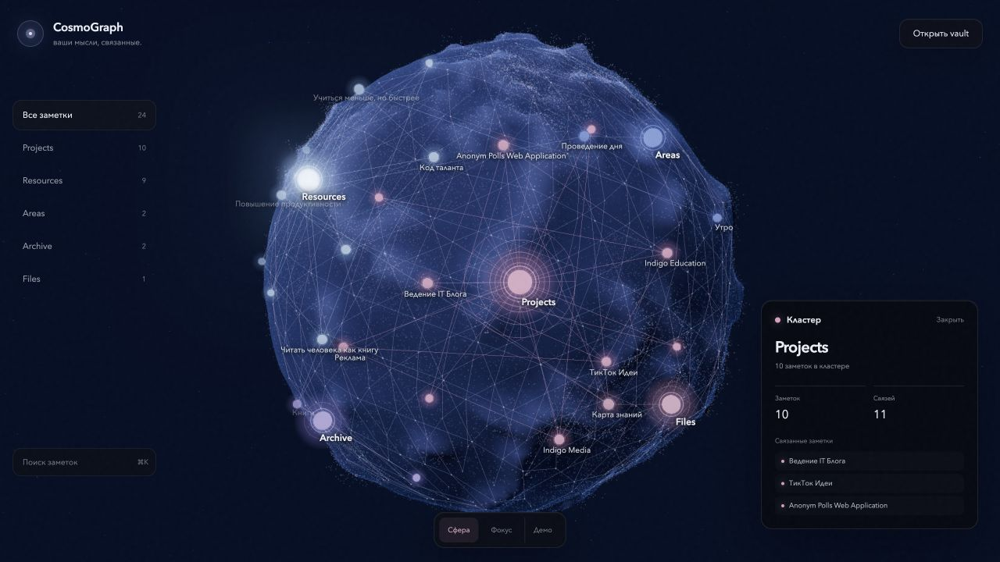

<div align="center">
  
</div>

<h1 align="center">CosmoGraph</h1>

<p align="center"><strong>A living 3D spherical knowledge graph for Obsidian.</strong></p>

<p align="center">
  Explore notes, links, folders, and clusters as an interactive cosmic atlas.<br />
  Built for visual thinkers who want their vault to feel like a world, not a diagram.
</p>

<p align="center">
  <a href="#run-the-web-prototype">Run locally</a>
  &nbsp;|&nbsp;
  <a href="#obsidian-plugin-roadmap">Plugin roadmap</a>
  &nbsp;|&nbsp;
  <a href="#how-it-works">How it works</a>
</p>

<p align="center">
  
  
  
  <a href="LICENSE"></a>
</p>

> [!IMPORTANT]
> CosmoGraph is currently an interactive web prototype. The native Obsidian community plugin is the next major milestone.

## Your vault has shape

Most knowledge graphs place notes on a flat canvas or inside an unstructured cloud. CosmoGraph gives the vault a surface, depth, terrain, and a sense of place.

Notes become luminous points on a procedural planet. Links form a network across its surface. Folders become visual clusters. Select any node and the sphere gently rotates to bring it into focus.

CosmoGraph is designed as an immersive alternative to the traditional Obsidian graph view, with a strong emphasis on spatial memory, clarity, and atmosphere.

## What the prototype already does

- Renders an interactive 3D spherical knowledge graph with Three.js and WebGL.
- Reads a local folder of Markdown notes directly in the browser.
- Extracts Obsidian-style `[[wikilinks]]` and builds note connections.
- Groups notes into visual clusters based on their folders.
- Maps nodes and links onto a procedural planetary surface.
- Generates irregular terrain, craters, particles, atmosphere, and depth.
- Supports orbit rotation, inertial dragging, zoom, hover, search, and selection.
- Smoothly rotates the sphere when a note is selected.
- Keeps vault data local. The prototype does not upload notes to a server.

## Run the web prototype

### Requirements

- Node.js 18 or newer
- npm
- A modern browser with WebGL support

### Start locally

```bash
git clone git@github.com:n1ghtmare-dev/obsidian-cosmograph.git
cd obsidian-cosmograph
npm install
npm run dev
```

Open the local Vite URL, select **Open vault**, and choose a folder containing Markdown files.

The browser reads the selected files locally, extracts wikilinks, and generates the spherical graph. No account or external API is required.

### Production build

```bash
npm run build
npm run preview
```

## How it works

```text
Markdown vault
      |
      v
Local file parser
      |
      v
Notes, wikilinks, and folders
      |
      v
Spherical layout and procedural terrain
      |
      v
Interactive Three.js knowledge graph
```

| Area | Responsibility |
| --- | --- |
| `src/vault.ts` | Reads Markdown files and resolves Obsidian-style wikilinks. |
| `src/graph/SphericalGraph.ts` | Builds the terrain, nodes, links, labels, lighting, and interactions. |
| `src/main.ts` | Connects the graph renderer to search, vault selection, and note details. |
| `src/data/sample.ts` | Provides a sample vault graph for instant local preview. |

The renderer and parser are intentionally separated from the Obsidian API. This makes the current web prototype useful as a visual laboratory while keeping the core ready for migration into an Obsidian `ItemView`.

## Obsidian plugin roadmap

The goal is a native **CosmoGraph 3D** community plugin with the plugin ID `cosmograph-3d`.

- Package the renderer inside an Obsidian `ItemView`.
- Replace browser folder selection with `app.vault.getMarkdownFiles()`.
- Use `metadataCache.resolvedLinks` for live vault connections.
- Open notes directly from graph nodes.
- React to note creation, rename, deletion, and metadata changes.
- Add controls for clusters, labels, colors, terrain, and performance.
- Optimize rendering for large vaults and lower-powered devices.
- Publish beta builds through GitHub Releases and BRAT.
- Submit the stable release to the Obsidian Community Plugins directory.

## Why a sphere?

A sphere creates a bounded world instead of an endless canvas. Every cluster has a location, distant areas remain discoverable, and rotation gives navigation a physical rhythm. The procedural relief adds landmarks that can support spatial memory as the vault grows.

The long-term vision is not simply a 3D graph. It is a navigable knowledge planet shaped by your notes.

## Privacy

CosmoGraph is local-first.

- Markdown files are read on the user's device.
- The current prototype makes no request to an analytics or storage backend.
- Vault contents are not uploaded by CosmoGraph.
- The planned Obsidian plugin will preserve the same local-first model.

## Technology

- TypeScript
- Three.js
- WebGL
- Vite
- CSS2DRenderer
- Unreal Bloom post-processing
- Procedural terrain and particle rendering

## Frequently asked questions

### Is CosmoGraph already an Obsidian plugin?

Not yet. This repository currently contains the working web prototype. Native Obsidian integration is the next development phase.

### Can I visualize my real Obsidian vault?

Yes. Run the prototype locally, choose **Open vault**, and select the folder that contains your Markdown notes.

### Does CosmoGraph modify my notes?

No. The web prototype reads selected Markdown files and builds an in-memory graph. It does not edit the source files.

### What makes CosmoGraph different from other 3D graph views?

CosmoGraph uses a bounded spherical layout with procedural planetary terrain. The product direction focuses on spatial memory, visual identity, and the feeling of navigating a living knowledge world.

## Contributing

The project is at an early stage, so focused feedback is especially valuable. Open an issue for rendering bugs, interaction ideas, large-vault performance findings, or Obsidian integration proposals.

If you want to contribute code:

1. Fork the repository.
2. Create a focused branch.
3. Run `npm run build` before opening a pull request.
4. Include a screenshot or short recording for visual changes.

## License

CosmoGraph is available under the [MIT License](LICENSE).

<p align="center">
  <strong>Turn your vault into a world.</strong>
</p>
